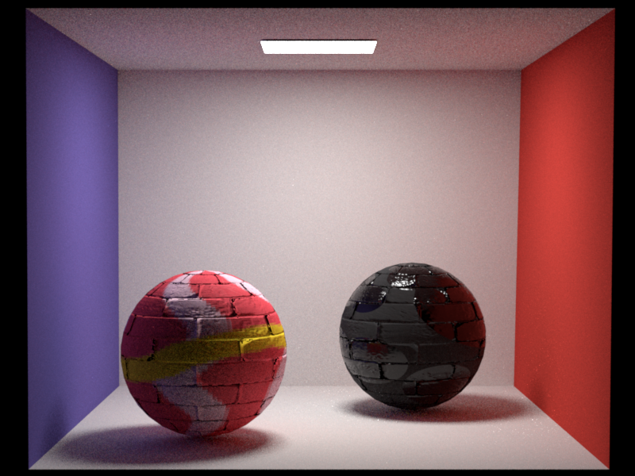
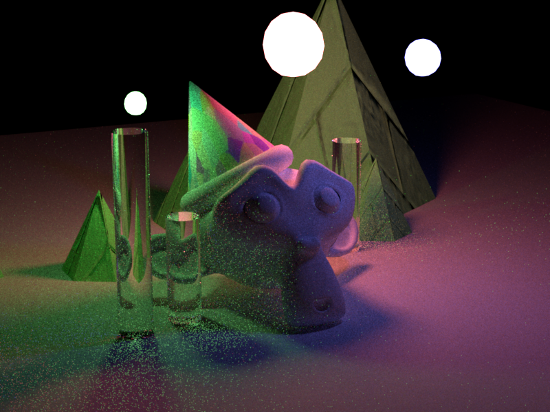

# Showcase of Nori Pathtracing Results
These are some of the renders realized using the pathtracer Nori as a base.

# Features
* Multiple Importance Sampling (Lights + BRDF) using Balance Heuristics
* Texture Support (Albedo, Normals, "Roughness")
* Microfacet Surface Model

# Showcase

